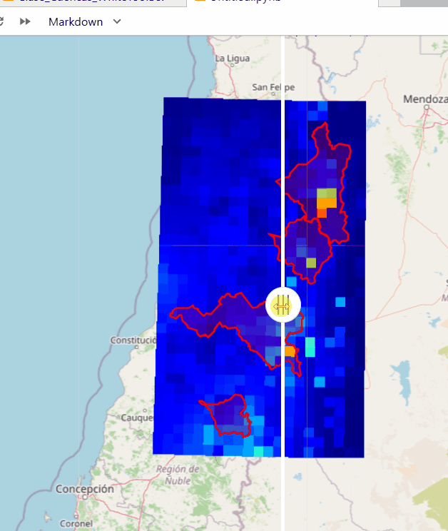

# Creación de mapas interactivos con LeafMap

LeafMap permite generar mapas interactivos en Python mediante la integración de información geoespacial vectorial, raster y servicios de mapas base. Esta herramienta facilita la visualización, exploración y publicación de datos espaciales mediante interfaces cartográficas interactivas.

La herramienta SplitMap permite visualizar simultáneamente dos capas raster dentro de un mismo mapa interactivo.

En este análisis se utiliza para comparar:

| Panel izquierdo | Panel derecho |
|---|---|
| Precipitación 23 junio 2023 | Precipitación 24 junio 2023 |

Además, se incorpora la capa vectorial de cuencas hidrográficas como referencia espacial para interpretar la distribución de las precipitaciones.

El siguiente GIF muestra el resultado del mapa comparativo generado con SplitMap, donde se observa la variación espacial de las precipitaciones entre dos fechas utilizando datos satelitales GPM y capas de cuencas hidrográficas.



El resultado corresponde a un mapa interactivo donde es posible:

- comparar cambios espaciales entre fechas.
- explorar valores de precipitación.
- visualizar la relación entre precipitaciones y unidades hidrográficas.
- exportar el resultado como archivo HTML.

---

# Creación del mapa interactivo

Para crear un mapa interactivo se utiliza la función `leafmap.Map()`, donde es posible definir parámetros iniciales como el centro del mapa, nivel de zoom y dimensiones de visualización.

```python
import leafmap

m = leafmap.Map(
    center=[-45, -75],
    zoom=6,
    height="500px",
    width="700px"
)

m
```

Parámetros utilizados:

- `center`: establece las coordenadas centrales del mapa.
- `zoom`: define el nivel inicial de acercamiento.
- `height` y `width`: determinan las dimensiones de la ventana interactiva.

---

# Incorporación de mapas base mediante XYZ Tiles

Los servicios XYZ Tiles permiten incorporar mapas base provenientes de diferentes proveedores cartográficos. LeafMap cuenta con herramientas para buscar servicios compatibles y agregarlos directamente al mapa.

```python
m.add_xyz_service("xyz.Stamen.Terrain")

m
```

Las capas agregadas pueden ser administradas desde el panel **Layers**, disponible dentro de la interfaz interactiva.

---

# Incorporación de datos vectoriales

LeafMap permite cargar información vectorial almacenada en formatos como Shapefile (`.shp`) mediante el método `add_vector()`.

```python
m.add_vector(
    "Cuencas.shp",
    layer_name="Cuencas_Sur",
    style={"color": "#00FF00"}
)

m
```

Parámetros utilizados:

- `layer_name`: define el nombre de la capa dentro del mapa.
- `style`: permite configurar la simbología de representación.

Ejemplo de modificación del color mediante código HEX:

```python
style={"color": "#00FF00"}
```

---

# Incorporación de datos vectoriales con clasificación temática

Además de representar geometrías, LeafMap permite visualizar variables asociadas a los atributos de una capa mediante métodos de clasificación estadística.

```python
m.add_data(
    "Cuencas.shp",
    column="AREAKM2",
    scheme="Quantiles",
    cmap="Greens",
    legend_title="Km2"
)

m
```

Configuración utilizada:

- `column`: corresponde al atributo utilizado para representar los valores.
- `scheme`: define el método estadístico para generar los rangos de clasificación.
- `cmap`: establece la escala de colores utilizada.
- `legend_title`: define el nombre mostrado en la leyenda.

Los métodos de clasificación permiten adaptar la representación cartográfica según la distribución de los datos y el objetivo del análisis.

---

# Incorporación de datos raster

LeafMap permite visualizar archivos raster como modelos digitales de elevación, imágenes satelitales y otros productos derivados.

Para trabajar con información raster se crea un nuevo objeto de mapa:

```python
r = leafmap.Map(
    center=[-45, -75],
    zoom=6,
    height="500px",
    width="700px"
)
```

---

## Visualización de un raster continuo

Ejemplo utilizando un modelo digital de elevación:

```python
r.add_raster(
    "dem.tif",
    palette="terrain",
    layer_name="elevacion"
)

r
```

Parámetros utilizados:

- `palette`: define la escala de colores utilizada para representar los valores del raster.
- `layer_name`: corresponde al nombre asignado a la capa dentro del mapa.

---

## Visualización de imágenes satelitales multibanda

LeafMap permite cargar imágenes satelitales seleccionando bandas específicas para generar composiciones RGB.

Ejemplo utilizando una imagen Landsat:

```python
r.add_raster(
    "LT05_232090_19980207.tif",
    bands=[5,4,1],
    layer_name="Landsat05_1998"
)

r
```

La combinación de bandas utilizada corresponde a:

- Banda 5 → canal rojo.
- Banda 4 → canal verde.
- Banda 1 → canal azul.

Esta configuración permite generar una composición RGB para la visualización e interpretación de imágenes satelitales.

---

# Exportación del mapa interactivo

Una vez configuradas las capas del mapa, LeafMap permite exportar el resultado como un archivo HTML interactivo.

```python
r.to_html("mapa_ejemplo.html")
```

El archivo generado contiene la configuración del mapa, capas incorporadas y elementos interactivos, permitiendo compartir la visualización sin necesidad de ejecutar nuevamente el código.

---

> [!WARNING]
> **Consideración importante sobre las teselas raster**
>
> Al incorporar archivos raster mediante `leafmap.add_raster()`, LeafMap utiliza `localtileserver` para generar las teselas necesarias para la visualización interactiva del mapa.
>
> Esto implica que las capas raster no quedan almacenadas directamente dentro del archivo HTML exportado, sino que dependen del servidor local de teselas generado durante la ejecución del código.
>
> ```python
> r.add_raster(
>     "dem.tif",
>     palette="terrain",
>     layer_name="elevacion"
> )
>
> r.to_html("mapa_ejemplo.html")
> ```
>
> El archivo HTML generado conserva la estructura del mapa y la configuración de las capas, pero requiere que el servicio local de teselas continúe activo para cargar correctamente la información raster.
>
> Por esta razón, al cerrar la sesión de trabajo donde se ejecuta Python, el servidor generado por `localtileserver` deja de funcionar y las teselas raster pueden dejar de visualizarse en el mapa exportado.

# Aplicación: Comparación espacial de precipitaciones mediante SplitMap

Como aplicación del flujo de visualización interactiva desarrollado con LeafMap, se realizará un análisis comparativo de precipitaciones utilizando datos satelitales GPM y capas vectoriales de cuencas hidrográficas.

El objetivo es integrar información raster y vectorial dentro de un mismo entorno interactivo, permitiendo comparar la distribución espacial de las precipitaciones ocurridas durante diferentes fechas y analizar su comportamiento dentro de unidades hidrográficas delimitadas.

Para este caso se utilizarán precipitaciones registradas durante los días:

- 23 de junio de 2023.
- 24 de junio de 2023.

Los datos de precipitación corresponden al producto satelital **Global Precipitation Measurement (GPM)**, mientras que las cuencas hidrográficas serán obtenidas mediante procesos de análisis hidrológico utilizando **WhiteboxTools**.

---

# Delimitación de cuencas hidrográficas mediante WhiteboxTools

Para incorporar unidades espaciales de análisis, se realiza previamente la delimitación de cuencas hidrográficas a partir de un modelo digital de elevación (DEM).

El procedimiento considera las siguientes etapas:

1. Corrección hidrológica del modelo digital de elevación.
2. Cálculo de dirección de flujo.
3. Determinación de acumulación de flujo.
4. Ajuste de puntos de salida o exutorios.
5. Delimitación automática de cuencas.
6. Conversión de resultados raster a formato vectorial.

Este proceso permite generar polígonos de cuenca que posteriormente serán utilizados como capa de referencia dentro del mapa interactivo.

---

# Integración de información de precipitación

Una vez obtenidas las cuencas hidrográficas, se incorporan las capas raster correspondientes a precipitaciones GPM.

Cada archivo representa la distribución espacial de precipitación acumulada para una fecha determinada:

```
GPM_2023_06_23.tif
GPM_2023_06_24.tif
```

Estos raster permiten evaluar diferencias espaciales entre ambos eventos mediante herramientas de comparación visual.

---

# Cálculo de precipitación máxima por cuenca

Para caracterizar el comportamiento de la precipitación dentro de cada unidad hidrográfica, se aplican estadísticas zonales entre:

- polígonos de cuencas,
- raster de precipitación GPM.

Como resultado, cada cuenca incorpora atributos asociados a:

- identificación de la unidad hidrográfica.
- precipitación máxima registrada durante el día 23 de junio.
- precipitación máxima registrada durante el día 24 de junio.

Esta información permite complementar la interpretación visual del mapa con valores cuantitativos asociados a cada territorio.

---


# Resultado final

El producto generado corresponde a un mapa interactivo en formato HTML que integra:

- capas raster de precipitación GPM.
- polígonos de cuencas hidrográficas.
- simbología temporal comparativa.
- barra de escala de precipitación.
- controles interactivos de LeafMap.

Este flujo puede ser replicado para diferentes fechas, regiones o unidades hidrográficas modificando únicamente los datos de entrada utilizados en el análisis.

---

## Technologies

- Python
- Leafmap
- Folium
- GeoPandas
- Rasterio
- WhiteboxTools
- Jupyter Notebook


*Este proyecto fue desarrollado originalmente como parte del curso **Aplicaciones de los Sistemas de Información Geográfica (SIG) y Ordenamiento Territorial con SIG y TICs** de la carrera de **Geografía** de la **Universidad Austral de Chile (UACh)**.*
